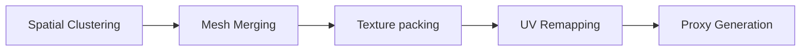

# Hierarchical Level of Detail (HLOD) System

The HLOD system combines clusters of distant static geometries into unified proxy meshes using shared, packed material textures (atlases). This drastically reduces both draw calls and vertex processing overhead for far scenes.

---

## The HLOD Pipeline

### 1. Spatial Clustering
We partition the scene using a uniform grid or an octree. GameObjects marked as `Static` inside each grid cell are grouped. Rendering bounds are evaluated to build the bounding boxes of the clusters.

### 2. Mesh Merging
For each cluster, we extract vertex data, normal vectors, tangent vectors, vertex colors, and index arrays. Using Unity's `CombineInstance` structures, we merge them into a single mesh layout.

### 3. Material Atlasing & UV Remapping
- We fetch Albedo, Normal, and Mask maps from the materials of all meshes inside a cluster.
- Using a rect packing algorithm, we assemble them into unified 2048x2048 or 4096x4096px textures.
- The UV coordinates of the combined mesh vertices are shifted and scaled to point to their corresponding packed rect bounds.

### 4. Proxy Generation & Swapping
We simplify the combined mesh using our simplification engine (reducing poly count by 75-90%). A prefab is generated containing the combined mesh and the atlas material.
At runtime, the `HLODController` monitors camera coordinates, enabling the proxy prefab and disabling the high-detail children when the camera crosses the cluster's distance threshold.

---

## Editor Settings
- **Cluster Cell Size**: The width/height of the grid volume (e.g. 50 meters).
- **Simplification Ratio**: Target decimation ratio for proxy meshes.
- **Atlas Resolution**: Output size of the combined textures.
- **Transition Distance**: Distance from the bounding box center to activate the proxy swap.
