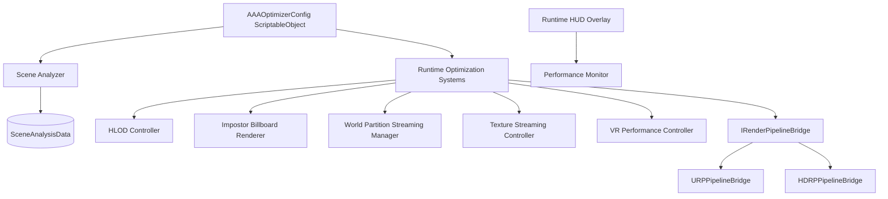

# System Architecture: AAAOptimizer

This document outlines the core architecture of the AAAOptimizer framework, illustrating the interaction between editor bakers, runtime streamers, pipeline bridges, and visualization tools.

---

## Architecture Overview

---

## Key Pillars

### 1. Unified Configuration (`AAAOptimizerConfig`)
All optimization systems pull thresholds, budgets, and toggles from a centralized ScriptableObject. This decoupling allows changing optimization strategies without recompiling scripts or editing scene components directly.

### 2. Rendering Abstraction (`IRenderPipelineBridge`)
To support both Universal Render Pipeline (URP) and High Definition Render Pipeline (HDRP), we use an abstraction bridge pattern. Common operations such as configuring material features, adjusting shadow maps, setting shader keywords, and applying dynamic resolution targets are routed through pipeline-specific bridges.

### 3. Separation of Concerns
All baking and asset creation tasks are executed strictly in the Editor. The runtime components are designed to be extremely lightweight, focusing solely on simple calculations (e.g. distance checks, swap states, memory monitoring) with zero CPU allocations in standard frame loops.

---

## Lifecycle Data Flows

### HLOD / Impostor Lifecycle
1. **Design Time**: The editor window traverses scene hierarchies, spatializes bounds, merges mesh indices, compiles texture atlases, or bakes 2D sprite cards.
2. **Serialization**: Generated meshes, textures, and materials are written as persistent asset files inside `Assets/AAAOptimizer/Data/` or `Addressables`.
3. **Runtime**: Swapper scripts monitor camera frustums and distances, loading assets asynchronously, and executing cheap distance switches.
